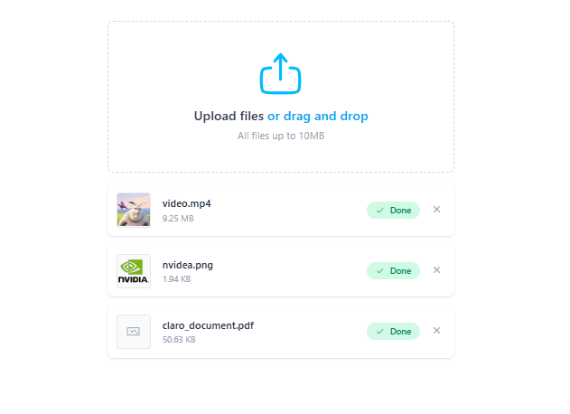

# File Uploads (Nuxt + Vue)



A compact, elegant Nuxt + Vue repository created to practice building a reusable file upload component.

This project demonstrates a small, production-like pattern for a `FileUpload` component located at `components/FileUpload/FileUpload.vue` (see `components/FileUpload/`). Use it as a learning sandbox or a drop-in component for small projects.

## What you'll find

- A minimal Nuxt app scaffolded with TypeScript and modern tooling.
- A focused `FileUpload` component with basic UI, validation and preview features.
- Clean, readable code intended for learning and iterative improvement.

Open `components/FileUpload/FileUpload.vue` to see how the component is implemented and customize validation, allowed types, and upload hooks.

## Run locally (fast)

Requirements:

- Node.js (16+ recommended)
- npm, yarn or pnpm

Steps (cross-shell friendly):

```bash
# install deps
npm install

# start dev server
npm run dev

# build for production
npm run build

# preview production build locally
npm run preview
```

If you prefer pnpm or yarn replace `npm install` and the script invocations accordingly (for example `pnpm install` / `pnpm dev`).

## Dependencies (high level)

- Nuxt 3 (framework)
- Vue 3 + TypeScript
- ESLint + Prettier (linting & formatting)

Specific versions are recorded in `package.json`.

## Nice-to-have features (ideas)

- Server-side upload endpoint (signed URLs / secure storage)
- Chunked and resumable uploads for large files
- Upload retry with exponential backoff and queued uploads
- Unit and E2E tests for the component
- Accessibility improvements (keyboard + screen reader support)

## Contributing

This repo is a personal practice project — contributions are welcome. Open a PR with a clear description of the change and a short demo or screenshots when relevant.
